# SME Collaboration Architecture

MigrationPilot's collaboration package enables Subject Matter Experts (SMEs) to review, validate, and enrich AI-extracted business rules. This human-in-the-loop approach ensures accuracy and captures institutional knowledge.

## Overview

```mermaid
flowchart TB
    subgraph Extraction["🤖 AI Extraction"]
        AE[Archeologist Agent]
        BR[Business Rules]
        CS[Confidence Scores]
        AE --> BR --> CS
    end

    subgraph Queue["📋 Review Queue"]
        HI[High Priority<br/>Low Confidence]
        MI[Medium Priority]
        LO[Low Priority<br/>High Confidence]
    end

    CS --> Queue

    subgraph Review["👥 SME Review"]
        RD[Review Dashboard]
        RC[Rule Card]
        AN[Annotations]
        DIS[Discussions]
    end

    Queue --> Review

    subgraph Actions["✅ SME Actions"]
        APP[Approve]
        MOD[Modify]
        REJ[Reject]
        CLR[Clarify]
    end

    Review --> Actions

    subgraph Output["📚 Validated Rules"]
        VR[Validated Business Rules]
        KC[Knowledge Captured]
        AH[Audit History]
    end

    Actions --> Output
```



## Core Components

### ReviewService

Manages the review workflow for business rules:

```typescript
import { ReviewService } from '@migrationpilot/collaboration';

const reviewService = new ReviewService({
  // Priority calculation
  priorityConfig: {
    lowConfidenceThreshold: 0.7,   // High priority if < 70%
    highConfidenceThreshold: 0.9,  // Low priority if > 90%
    complexityWeight: 0.3,
    impactWeight: 0.4,
  },
  
  // Review settings
  reviewSettings: {
    defaultDeadline: '7d',
    reminderIntervals: ['24h', '4h'],
    requireApproval: true,
    minReviewers: 1,
  },
  
  // Notification service
  notificationService,
});
```

### Review Workflow States


### Creating Review Requests

```typescript
// Create review request for a rule
const review = await reviewService.createReview({
  ruleId: 'rule-123',
  projectId: 'project-456',
  
  // Context for reviewers
  context: {
    sourceFile: 'CALCINT.cbl',
    sourceLines: [245, 280],
    sourceCode: cobolCode,
    aiConfidence: 0.72,
    aiExplanation: 'Interest calculation with compound formula',
  },
  
  // Assignment
  assignees: ['sme@company.com'],
  deadline: new Date('2024-02-15'),
  priority: 'high',
  
  // Tags for categorization
  tags: ['finance', 'calculation', 'critical'],
});
```

### Submitting Decisions

```typescript
// Approve rule
await reviewService.submitDecision({
  reviewId: review.id,
  decision: 'approved',
  reviewerId: 'sme@company.com',
  comments: 'Verified against business requirements doc v2.3',
});

// Modify rule
await reviewService.submitDecision({
  reviewId: review.id,
  decision: 'modified',
  reviewerId: 'sme@company.com',
  modifications: [
    {
      field: 'formula',
      oldValue: 'principal * rate / 100',
      newValue: 'principal * rate / 100 * (1 + rate/100)^periods',
      reason: 'Missing compound interest factor',
    },
    {
      field: 'description',
      oldValue: 'Simple interest calculation',
      newValue: 'Compound interest calculation with annual compounding',
      reason: 'Clarified calculation type',
    },
  ],
  comments: 'Updated to reflect compound interest formula per policy doc',
});

// Request clarification
await reviewService.submitDecision({
  reviewId: review.id,
  decision: 'needs-clarification',
  reviewerId: 'sme@company.com',
  questions: [
    'Is the rate annual or monthly?',
    'Should penalties apply after 30 days or 60 days?',
  ],
});
```

## Discussion Threads

### Real-Time Collaboration

```mermaid
flowchart LR
    subgraph Thread["Discussion Thread"]
        M1[Message 1: Question]
        M2[Message 2: Answer]
        M3[Message 3: Follow-up]
        M4[Message 4: Resolution]
    end

    subgraph Features["Features"]
        AT[@Mentions]
        RE[Reactions]
        ATT[Attachments]
        CODE[Code References]
    end

    Thread --- Features

    subgraph Resolution["Resolution"]
        SUM[Summary]
        AI[Action Items]
    end

    Thread --> Resolution
```

### Discussion API

```typescript
import { DiscussionService } from '@migrationpilot/collaboration';

const discussionService = new DiscussionService();

// Start a discussion
const discussion = await discussionService.create({
  ruleId: 'rule-123',
  topic: 'Clarification on penalty calculation',
  participants: ['sme1@company.com', 'sme2@company.com', 'dev@company.com'],
});

// Add message
await discussionService.addMessage({
  discussionId: discussion.id,
  author: 'dev@company.com',
  type: 'question',
  content: 'The code shows a 5% penalty, but the documentation says 3%. Which is correct?',
  references: [
    { type: 'code', file: 'CALCPEN.cbl', lines: [120, 125] },
    { type: 'document', url: 'https://docs.company.com/policies/penalties.pdf', page: 12 },
  ],
});

// Add reaction
await discussionService.addReaction({
  discussionId: discussion.id,
  messageId: 'msg-456',
  userId: 'sme1@company.com',
  emoji: '👍',
});

// Mention someone
await discussionService.addMessage({
  discussionId: discussion.id,
  author: 'sme1@company.com',
  type: 'answer',
  content: '@sme2 Can you verify this against the 2023 policy update?',
  mentions: ['sme2@company.com'],
});

// Resolve discussion
await discussionService.resolve({
  discussionId: discussion.id,
  summary: 'Confirmed: 3% penalty is correct. Code needs update.',
  actionItems: [
    { description: 'Update CALCPEN.cbl line 122', assignee: 'dev@company.com' },
    { description: 'Update business rule BR-045', assignee: 'sme1@company.com' },
  ],
  resolvedBy: 'sme1@company.com',
});
```

## Knowledge Capture

### KnowledgeCaptureService

Captures and validates institutional knowledge:

```typescript
import { KnowledgeCaptureService } from '@migrationpilot/collaboration';

const knowledgeService = new KnowledgeCaptureService({
  // Auto-classification
  autoClassify: true,
  
  // Confidence based on source
  sourceConfidence: {
    'sme-interview': 0.9,
    'document': 0.7,
    'discussion': 0.6,
    'inference': 0.4,
  },
});
```

### Knowledge Entry Types

| Type | Description | Example |
|------|-------------|---------|
| `business-rule` | Documented business logic | "Interest is calculated monthly" |
| `data-mapping` | Field/value mappings | "Status 'A' = Active, 'I' = Inactive" |
| `edge-case` | Exception handling | "Zero balance accounts skip fee calculation" |
| `domain-concept` | Business terminology | "APR = Annual Percentage Rate" |
| `workaround` | Known quirks/hacks | "Add 1 day to avoid month-end bug" |
| `process` | Business workflow | "Loans require manager approval over $50k" |

### Capturing Knowledge

```typescript
// Capture from SME interview
const entry = await knowledgeService.capture({
  type: 'business-rule',
  source: 'sme-interview',
  
  content: 'Late payment fees apply after 30 days for retail accounts, but 60 days for commercial accounts.',
  
  relatedEntities: [
    { type: 'rule', id: 'BR-045' },
    { type: 'file', path: 'CALCFEE.cbl' },
  ],
  
  tags: ['fees', 'payments', 'account-type'],
  
  capturedBy: 'analyst@company.com',
  smeSource: 'john.smith@company.com',
});

// Verify knowledge
await knowledgeService.verify({
  entryId: entry.id,
  verifiedBy: 'senior-sme@company.com',
  status: 'verified',
  comments: 'Confirmed per policy document POL-2023-045',
});
```

### Auto-Detection

```typescript
// Analyze content to classify knowledge type
const classification = await knowledgeService.classify(content);
// {
//   type: 'edge-case',
//   confidence: 0.85,
//   entities: ['late-fee', 'grace-period'],
//   suggestedTags: ['payments', 'exceptions']
// }
```

### Knowledge Search

```typescript
// Search captured knowledge
const results = await knowledgeService.search({
  query: 'late payment fee',
  filters: {
    type: ['business-rule', 'edge-case'],
    status: 'verified',
    minConfidence: 0.7,
  },
  sort: { field: 'confidence', order: 'desc' },
});
```

## Notification System

### Notification Configuration

```typescript
import { NotificationService } from '@migrationpilot/collaboration';

const notificationService = new NotificationService({
  channels: [
    {
      type: 'email',
      config: {
        from: 'migrationpilot@company.com',
        smtp: process.env.SMTP_CONFIG,
      },
    },
    {
      type: 'slack',
      config: {
        webhookUrl: process.env.SLACK_WEBHOOK,
        channel: '#migration-reviews',
      },
    },
    {
      type: 'teams',
      config: {
        webhookUrl: process.env.TEAMS_WEBHOOK,
      },
    },
  ],
  
  // Template configuration
  templates: {
    reviewAssigned: {
      subject: 'New rule review assigned: {{ruleName}}',
      body: reviewAssignedTemplate,
    },
    reviewDeadline: {
      subject: 'Review deadline approaching: {{ruleName}}',
      body: deadlineTemplate,
    },
    mentionNotification: {
      subject: 'You were mentioned in a discussion',
      body: mentionTemplate,
    },
  },
});
```

### Notification Events

| Event | Recipients | Channels |
|-------|------------|----------|
| `review.assigned` | Assignee | Email, Slack |
| `review.deadline` | Assignee | Email, Slack |
| `review.decision` | Project team | Slack |
| `discussion.mention` | Mentioned user | Email, Slack, Teams |
| `discussion.reply` | Thread participants | Email |
| `knowledge.verified` | Original author | Email |

## Review Dashboard

### Dashboard Features

```mermaid
flowchart TB
    subgraph Dashboard["📊 Review Dashboard"]
        subgraph Stats["Statistics"]
            PEND[Pending: 45]
            PROG[In Progress: 12]
            COMP[Completed: 238]
        end

        subgraph Queue["Review Queue"]
            Q1[🔴 High Priority: 8]
            Q2[🟡 Medium: 25]
            Q3[🟢 Low: 12]
        end

        subgraph Filters["Filters"]
            F1[By Assignee]
            F2[By Confidence]
            F3[By Category]
            F4[By Status]
        end

        subgraph Cards["Rule Cards"]
            C1[Rule Card 1]
            C2[Rule Card 2]
            C3[Rule Card 3]
        end
    end

    Stats --> Queue --> Filters --> Cards
```



### Rule Card Component

```typescript
interface RuleCardProps {
  rule: BusinessRule;
  review: Review;
  
  // Display options
  showSourceCode: boolean;
  showAiExplanation: boolean;
  showSimilarRules: boolean;
  
  // Actions
  onApprove: () => void;
  onModify: () => void;
  onReject: () => void;
  onRequestClarification: () => void;
  onStartDiscussion: () => void;
}
```

## Audit Trail

### Complete History Tracking

```typescript
interface AuditEntry {
  id: string;
  timestamp: Date;
  
  // Actor
  userId: string;
  userEmail: string;
  
  // Action
  action: 'created' | 'assigned' | 'viewed' | 'commented' | 'decided' | 'modified';
  
  // Context
  resourceType: 'rule' | 'review' | 'discussion' | 'knowledge';
  resourceId: string;
  
  // Changes
  changes?: {
    field: string;
    oldValue: any;
    newValue: any;
  }[];
  
  // Metadata
  ipAddress: string;
  userAgent: string;
}
```

### Version History

```typescript
// Get rule version history
const versions = await reviewService.getRuleVersions('rule-123');

// Compare versions
const diff = await reviewService.compareVersions('rule-123', {
  fromVersion: 1,
  toVersion: 3,
});
// {
//   changes: [
//     { field: 'formula', from: '...', to: '...', changedIn: 2 },
//     { field: 'description', from: '...', to: '...', changedIn: 3 },
//   ]
// }
```

## Database Schema

```typescript
// Reviews table
export const reviews = pgTable('reviews', {
  id: uuid('id').primaryKey(),
  ruleId: uuid('rule_id').references(() => businessRules.id),
  projectId: uuid('project_id').references(() => projects.id),
  status: reviewStatusEnum('status').default('pending'),
  priority: priorityEnum('priority').default('medium'),
  assigneeId: uuid('assignee_id').references(() => users.id),
  deadline: timestamp('deadline'),
  aiConfidence: decimal('ai_confidence'),
  createdAt: timestamp('created_at').defaultNow(),
  completedAt: timestamp('completed_at'),
});

// Review decisions table
export const reviewDecisions = pgTable('review_decisions', {
  id: uuid('id').primaryKey(),
  reviewId: uuid('review_id').references(() => reviews.id),
  reviewerId: uuid('reviewer_id').references(() => users.id),
  decision: decisionEnum('decision'),
  comments: text('comments'),
  modifications: jsonb('modifications'),
  createdAt: timestamp('created_at').defaultNow(),
});

// Discussions table
export const discussions = pgTable('discussions', {
  id: uuid('id').primaryKey(),
  ruleId: uuid('rule_id').references(() => businessRules.id),
  topic: varchar('topic', { length: 255 }),
  status: discussionStatusEnum('status').default('open'),
  resolution: text('resolution'),
  createdAt: timestamp('created_at').defaultNow(),
  resolvedAt: timestamp('resolved_at'),
});

// Discussion messages table
export const discussionMessages = pgTable('discussion_messages', {
  id: uuid('id').primaryKey(),
  discussionId: uuid('discussion_id').references(() => discussions.id),
  authorId: uuid('author_id').references(() => users.id),
  type: messageTypeEnum('type'),
  content: text('content'),
  mentions: jsonb('mentions').default([]),
  reactions: jsonb('reactions').default({}),
  createdAt: timestamp('created_at').defaultNow(),
});

// Knowledge entries table
export const knowledgeEntries = pgTable('knowledge_entries', {
  id: uuid('id').primaryKey(),
  type: knowledgeTypeEnum('type'),
  source: knowledgeSourceEnum('source'),
  content: text('content'),
  confidence: decimal('confidence'),
  status: knowledgeStatusEnum('status').default('draft'),
  relatedEntities: jsonb('related_entities').default([]),
  tags: jsonb('tags').default([]),
  capturedBy: uuid('captured_by').references(() => users.id),
  verifiedBy: uuid('verified_by').references(() => users.id),
  verifiedAt: timestamp('verified_at'),
  createdAt: timestamp('created_at').defaultNow(),
});
```

## Metrics & Reporting

### Review Metrics

```typescript
const metrics = await reviewService.getMetrics({
  projectId: 'project-456',
  dateRange: { from: '2024-01-01', to: '2024-01-31' },
});

// {
//   totalReviews: 295,
//   completed: 238,
//   pending: 45,
//   inProgress: 12,
//   
//   byDecision: {
//     approved: 180,
//     modified: 45,
//     rejected: 13,
//   },
//   
//   averageResponseTime: '2.3 days',
//   averageConfidenceIncrease: 0.12,
//   
//   topReviewers: [
//     { user: 'sme1@company.com', reviews: 45 },
//     { user: 'sme2@company.com', reviews: 38 },
//   ],
// }
```

## Related Topics

- [Business Rules](/docs/concepts/business-rules) - Rule extraction details
- [AI Agents: Archeologist](/docs/architecture/agents#archeologist-agent) - Rule extraction agent
- [Getting Started](/docs/getting-started/quickstart) - Quick start guide
