# Code Generators Architecture

MigrationPilot's generators package transforms legacy code analysis into clean, idiomatic modern code. Each target language has a specialized generator that applies framework-specific patterns and best practices.

## Overview

```mermaid
flowchart TB
    subgraph Input["📥 Input"]
        LA[Legacy Analysis]
        AD[Architecture Design]
        BR[Business Rules]
    end

    subgraph Generator["🔧 Code Generator"]
        BG[Base Generator]
        TM[Type Mapper]
        TG[Template Engine]
    end

    Input --> Generator

    subgraph Languages["🎯 Target Languages"]
        JAVA[Java/Spring]
        PY[Python/FastAPI]
        TS[TypeScript/NestJS]
        GO[Go/Gin]
        CS[C#/.NET]
    end

    Generator --> Languages

    subgraph Output["📤 Output"]
        GF[Generated Files]
        SM[Source Mappings]
        DOC[Documentation]
        TEST[Tests]
    end

    Languages --> Output
```



## Core Components

### BaseGenerator

Abstract base class that all language generators extend:

```typescript
import { BaseGenerator, GeneratorConfig } from '@migrationpilot/generators';

abstract class BaseGenerator {
  protected config: GeneratorConfig;
  protected warnings: string[] = [];
  
  // Main entry point
  async generate(
    analysis: LegacyAnalysis, 
    design: ModuleDesign
  ): Promise<GenerationResult>;
  
  // Abstract methods implemented by language generators
  protected abstract generateModels(dataStructures: DataStructure[]): GeneratedFile[];
  protected abstract generateInterfaces(services: ServiceDefinition[]): GeneratedFile[];
  protected abstract generateServices(services: ServiceDefinition[], rules: BusinessRule[]): GeneratedFile[];
  protected abstract generateTests(services: ServiceDefinition[]): GeneratedFile[];
  
  // Type mapping (language-specific)
  protected abstract mapType(legacyType: string): string;
  protected abstract getFileExtension(): string;
}
```

### Generator Configuration

```typescript
interface GeneratorConfig {
  // Target
  language: 'java' | 'python' | 'typescript' | 'go' | 'csharp';
  framework: string;  // 'spring', 'fastapi', 'nestjs', 'gin', 'dotnet'
  
  // Output
  outputDir: string;
  packageName: string;  // Java/Go package, Python module, etc.
  
  // Style
  style: {
    indentation: 'spaces' | 'tabs';
    indentSize: number;
    lineEnding: 'lf' | 'crlf';
    maxLineLength: number;
  };
  
  // Features
  generateTests: boolean;
  generateDocs: boolean;
  includeComments: boolean;
  traceability: boolean;  // Include source references
  
  // Framework-specific options
  frameworkOptions: Record<string, any>;
}
```

## Target Language Generators

### Java/Spring Generator

```typescript
import { SpringGenerator } from '@migrationpilot/generators';

const generator = new SpringGenerator({
  language: 'java',
  framework: 'spring',
  packageName: 'com.company.migration',
  
  frameworkOptions: {
    springBootVersion: '3.2.0',
    javaVersion: '21',
    useRecords: true,      // Use Java records for DTOs
    useLombok: false,      // Don't use Lombok
    useJakartaEE: true,    // Jakarta EE annotations
    databaseType: 'postgresql',
    includeSwagger: true,
  },
});
```

**Generated Structure:**

```
src/main/java/com/company/migration/
├── model/
│   ├── Customer.java
│   └── Account.java
├── repository/
│   ├── CustomerRepository.java
│   └── AccountRepository.java
├── service/
│   ├── LoanCalculationService.java
│   └── InterestService.java
├── controller/
│   └── LoanController.java
└── config/
    └── ApplicationConfig.java
```

**Type Mapping:**

| Legacy (COBOL) | Java Type |
|----------------|-----------|
| `PIC 9(n)` | `Integer` / `Long` |
| `PIC 9(n)V9(m)` | `BigDecimal` |
| `PIC X(n)` | `String` |
| `PIC S9(n)` | `Integer` (signed) |
| `COMP-3` | `BigDecimal` |

### Python/FastAPI Generator

```typescript
import { FastAPIGenerator } from '@migrationpilot/generators';

const generator = new FastAPIGenerator({
  language: 'python',
  framework: 'fastapi',
  packageName: 'migration_app',
  
  frameworkOptions: {
    pythonVersion: '3.11',
    usePydantic: true,
    useAsyncio: true,
    sqlalchemy: true,
    alembic: true,
    pytest: true,
  },
});
```

**Generated Structure:**

```
migration_app/
├── models/
│   ├── __init__.py
│   ├── customer.py
│   └── account.py
├── schemas/
│   ├── __init__.py
│   └── loan.py
├── services/
│   ├── __init__.py
│   └── loan_calculation.py
├── routers/
│   ├── __init__.py
│   └── loans.py
├── main.py
└── config.py
```

**Type Mapping:**

| Legacy (COBOL) | Python Type |
|----------------|-------------|
| `PIC 9(n)` | `int` |
| `PIC 9(n)V9(m)` | `Decimal` |
| `PIC X(n)` | `str` |
| Date fields | `datetime.date` |

### TypeScript/NestJS Generator

```typescript
import { NestJSGenerator } from '@migrationpilot/generators';

const generator = new NestJSGenerator({
  language: 'typescript',
  framework: 'nestjs',
  packageName: '@migration/app',
  
  frameworkOptions: {
    nodeVersion: '20',
    useTypeORM: true,
    useSwagger: true,
    useValidationPipes: true,
    strictNullChecks: true,
  },
});
```

**Generated Structure:**

```
src/
├── modules/
│   └── loan/
│       ├── loan.module.ts
│       ├── loan.controller.ts
│       ├── loan.service.ts
│       ├── loan.entity.ts
│       └── dto/
│           ├── create-loan.dto.ts
│           └── loan-response.dto.ts
├── common/
│   └── decorators/
├── app.module.ts
└── main.ts
```

### Go/Gin Generator

```typescript
import { GinGenerator } from '@migrationpilot/generators';

const generator = new GinGenerator({
  language: 'go',
  framework: 'gin',
  packageName: 'github.com/company/migration',
  
  frameworkOptions: {
    goVersion: '1.21',
    useGorm: true,
    useSwagger: true,
    useZap: true,  // Structured logging
  },
});
```

**Generated Structure:**

```
cmd/
└── server/
    └── main.go
internal/
├── models/
│   ├── customer.go
│   └── account.go
├── handlers/
│   └── loan_handler.go
├── services/
│   └── loan_service.go
└── repository/
    └── loan_repository.go
pkg/
└── utils/
```

### C#/.NET Generator

```typescript
import { DotNetGenerator } from '@migrationpilot/generators';

const generator = new DotNetGenerator({
  language: 'csharp',
  framework: 'dotnet',
  packageName: 'Company.Migration',
  
  frameworkOptions: {
    dotnetVersion: '8.0',
    useMinimalApis: false,  // Use controllers
    useEntityFramework: true,
    useSwagger: true,
    useRecords: true,
  },
});
```

**Generated Structure:**

```
src/
├── Company.Migration.Api/
│   ├── Controllers/
│   │   └── LoanController.cs
│   ├── Program.cs
│   └── appsettings.json
├── Company.Migration.Core/
│   ├── Entities/
│   │   └── Loan.cs
│   ├── Services/
│   │   └── LoanCalculationService.cs
│   └── Interfaces/
│       └── ILoanService.cs
└── Company.Migration.Infrastructure/
    └── Repositories/
        └── LoanRepository.cs
```

## Code Generation Process

### Generation Flow


### Model Generation

```typescript
// From COBOL data structure:
// 01 CUSTOMER-RECORD.
//    05 CUSTOMER-ID      PIC 9(8).
//    05 CUSTOMER-NAME    PIC X(50).
//    05 ACCOUNT-BALANCE  PIC S9(10)V99.

// Generated Java:
@Entity
@Table(name = "customers")
public class Customer {
    
    @Id
    @Column(name = "customer_id")
    private Long customerId;
    
    @Column(name = "customer_name", length = 50)
    private String customerName;
    
    @Column(name = "account_balance", precision = 12, scale = 2)
    private BigDecimal accountBalance;
    
    // Getters, setters, equals, hashCode...
}
```

### Service Generation

```typescript
// From COBOL procedure and business rule:
// COMPUTE WS-INTEREST = WS-PRINCIPAL * WS-RATE / 100.

// Generated Java service:
@Service
@Transactional
public class InterestCalculationService {
    
    /**
     * Calculate simple interest.
     * 
     * Source: CALCINT.cbl lines 245-280
     * Business Rule: BR-001 (Interest Rate Calculation)
     * Confidence: 95%
     */
    public BigDecimal calculateInterest(BigDecimal principal, BigDecimal rate) {
        // Validation
        Objects.requireNonNull(principal, "Principal cannot be null");
        Objects.requireNonNull(rate, "Rate cannot be null");
        
        // Business logic (from legacy code)
        return principal.multiply(rate)
                       .divide(BigDecimal.valueOf(100), 2, RoundingMode.HALF_UP);
    }
}
```

## Source Mapping

### Code Mapper

Tracks relationships between legacy and generated code:

```typescript
import { CodeMapper } from '@migrationpilot/generators';

const mapper = new CodeMapper();

// Record mapping during generation
mapper.addMapping({
  legacy: {
    file: 'CALCINT.cbl',
    lines: [245, 280],
    procedure: 'CALCULATE-INTEREST',
  },
  modern: {
    file: 'InterestCalculationService.java',
    lines: [25, 45],
    method: 'calculateInterest',
  },
  type: 'direct',  // direct, split, merge, refactor
  businessRule: 'BR-001',
  confidence: 0.95,
});
```

### Mapping Types

| Type | Description |
|------|-------------|
| `direct` | 1:1 mapping from legacy to modern |
| `split` | One legacy element → multiple modern elements |
| `merge` | Multiple legacy elements → one modern element |
| `refactor` | Significant structural change |
| `generated` | New code with no legacy equivalent |
| `deleted` | Legacy code with no modern equivalent |

### Export Formats

```typescript
// Export as JSON document
const document = mapper.toDocument();

// Export as HTML visualization
const html = mapper.toHtml({
  showSourceCode: true,
  interactive: true,
});
```

## Test Generation

### Generated Test Structure

```typescript
// Generated JUnit test for Java:
@ExtendWith(MockitoExtension.class)
class InterestCalculationServiceTest {
    
    @InjectMocks
    private InterestCalculationService service;
    
    /**
     * Test case from business rule BR-001
     * Boundary: Zero principal
     */
    @Test
    void calculateInterest_zeroPrincipal_returnsZero() {
        BigDecimal result = service.calculateInterest(
            BigDecimal.ZERO, 
            new BigDecimal("5.5")
        );
        
        assertEquals(BigDecimal.ZERO.setScale(2), result);
    }
    
    /**
     * Test case from business rule BR-001
     * Standard calculation
     */
    @Test
    void calculateInterest_standardValues_calculatesCorrectly() {
        BigDecimal result = service.calculateInterest(
            new BigDecimal("10000.00"), 
            new BigDecimal("5.5")
        );
        
        // Expected: 10000 * 5.5 / 100 = 550.00
        assertEquals(new BigDecimal("550.00"), result);
    }
    
    // TODO: Add edge case tests
    // TODO: Add property-based tests
}
```

## Generation Result

### Output Structure

```typescript
interface GenerationResult {
  // Generated files
  files: GeneratedFile[];
  
  // Source mappings
  mappings: SourceMapping[];
  
  // Statistics
  stats: {
    totalFiles: number;
    models: number;
    services: number;
    tests: number;
    linesOfCode: number;
  };
  
  // Issues
  warnings: string[];
  errors: string[];
  
  // Metadata
  metadata: {
    generatedAt: Date;
    generator: string;
    version: string;
    config: GeneratorConfig;
  };
}

interface GeneratedFile {
  path: string;
  content: string;
  type: 'model' | 'service' | 'controller' | 'repository' | 'test' | 'config' | 'doc';
  language: string;
  
  // Traceability
  sourceFiles: string[];
  businessRules: string[];
}
```

## CLI Usage

```bash
# Generate code
migrationpilot generate \
  --project my-migration \
  --target java \
  --framework spring \
  --output ./generated

# Generate with specific options
migrationpilot generate \
  --project my-migration \
  --target typescript \
  --framework nestjs \
  --output ./generated \
  --include-tests \
  --include-docs \
  --package-name @myorg/migrated-app
```

## Customization

### Custom Templates

```typescript
const generator = new SpringGenerator({
  // ...
  templates: {
    // Override default templates
    service: customServiceTemplate,
    model: customModelTemplate,
    
    // Add custom templates
    customComponent: myCustomTemplate,
  },
});
```

### Custom Type Mappings

```typescript
const generator = new SpringGenerator({
  // ...
  customTypeMappings: {
    // Legacy type → Modern type
    'PIC 9(8) COMP-3': 'Long',
    'PIC X(1) VALUE "Y/N"': 'Boolean',
  },
});
```

### Post-Processing Hooks

```typescript
const generator = new SpringGenerator({
  // ...
  hooks: {
    afterGenerate: async (files) => {
      // Run formatter
      await runSpotless(files);
      
      // Add license headers
      return addLicenseHeaders(files);
    },
  },
});
```

## Best Practices

1. **Review Generated Code**: Always review generated code before committing
2. **Customize Templates**: Adjust templates to match your coding standards
3. **Include Traceability**: Keep source mappings for audit and debugging
4. **Generate Tests**: Always generate test stubs, then enhance with real assertions
5. **Iterate**: Use the Builder agent iteratively to refine generated code

## Related Topics

- [AI Agents: Builder](/docs/architecture/agents#builder-agent) - Code generation agent
- [Parsers](/docs/architecture/parsers) - Input for code generation
- [Testing](/docs/architecture/testing) - Validating generated code
- [CLI Migrate](/docs/cli/migrate) - Command-line migration
