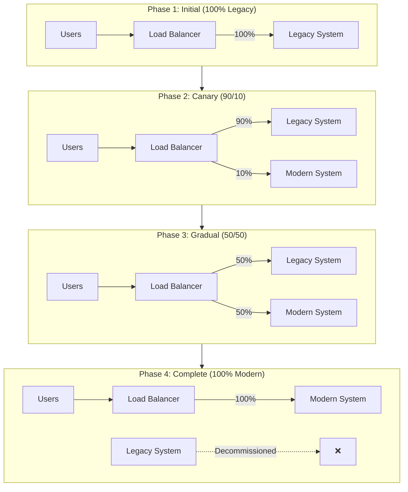
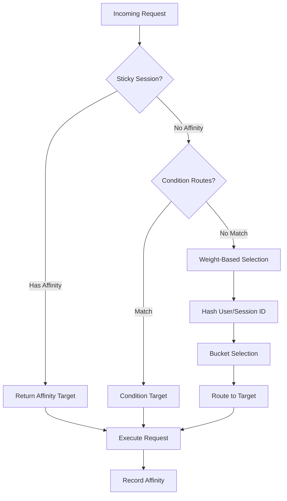
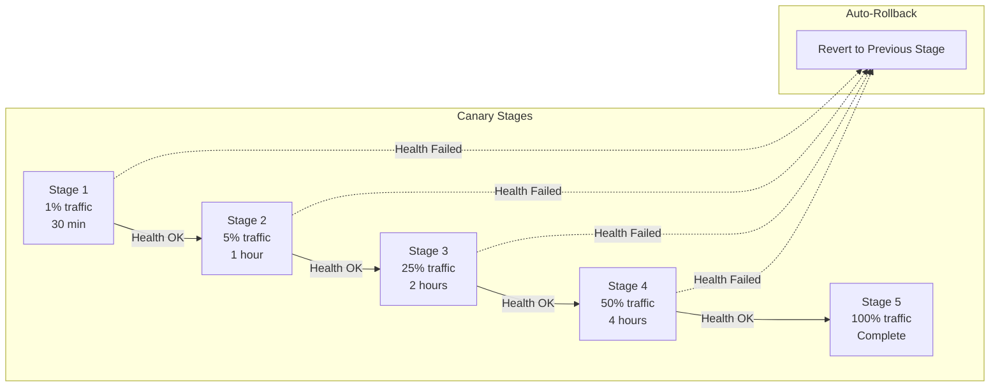
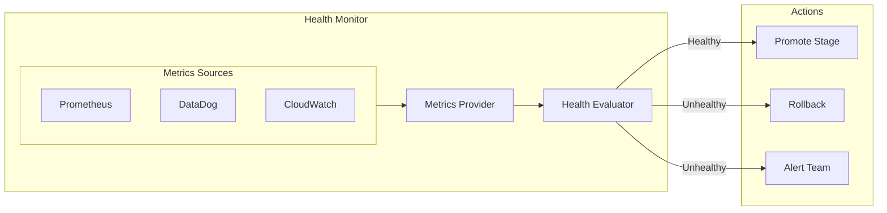
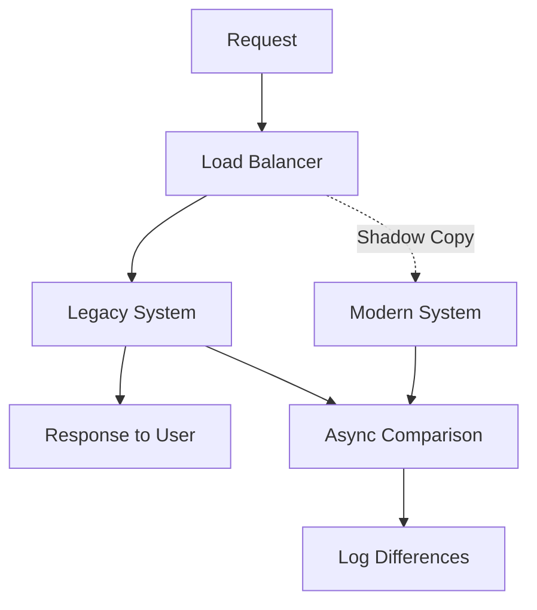

# Strangler Fig & Rollout Architecture

MigrationPilot's rollout package implements the Strangler Fig pattern for safe, incremental migration from legacy to modern systems. This enables gradual traffic shifting with automatic health monitoring and rollback capabilities.

## The Strangler Fig Pattern



## Core Components

### StranglerFigRouter

The central routing component that directs traffic between legacy and modern systems:

```typescript
import { StranglerFigRouter } from '@migrationpilot/rollout';

const router = new StranglerFigRouter({
  legacy: {
    name: 'Legacy COBOL Service',
    url: 'http://mainframe-gateway:8080',
    healthCheck: '/health',
  },
  modern: {
    name: 'Modern Java Service',
    url: 'http://loan-service:3000',
    healthCheck: '/actuator/health',
  },
  
  // Initial traffic split
  defaultWeight: {
    legacy: 100,
    modern: 0,
  },
  
  // Session affinity
  stickySession: {
    enabled: true,
    key: 'userId',
    ttl: 3600,
  },
});
```

### Routing Decision Flow



### Routing Strategies

#### 1. Weight-Based Routing

```typescript
// Configure traffic split
router.setWeights({
  legacy: 70,
  modern: 30,
});

// Deterministic routing based on user ID hash
// Same user always routes to same system
```

#### 2. Condition-Based Routing

```typescript
router.addConditionRoute({
  name: 'beta-users',
  priority: 10,
  conditions: [
    { type: 'header', key: 'X-Beta-User', value: 'true' },
  ],
  target: 'modern',
});

router.addConditionRoute({
  name: 'specific-endpoints',
  priority: 5,
  conditions: [
    { type: 'path', pattern: '/api/loans/calculate' },
  ],
  target: 'modern',
});
```

#### 3. Feature Flag Routing

```typescript
router.addFeatureFlag({
  name: 'new-loan-calculator',
  enabled: true,
  rolloutPercentage: 25,
  targeting: {
    attributes: ['department', 'region'],
    rules: [
      { attribute: 'department', operator: 'in', values: ['engineering', 'qa'] },
    ],
  },
});
```

## Deployment Strategies

### Canary Deployment



```typescript
import { RolloutOrchestrator } from '@migrationpilot/rollout';

const orchestrator = new RolloutOrchestrator({
  router,
  strategy: 'canary',
  
  stages: [
    { name: 'canary-1', trafficPercent: 1, duration: '30m' },
    { name: 'canary-5', trafficPercent: 5, duration: '1h' },
    { name: 'canary-25', trafficPercent: 25, duration: '2h' },
    { name: 'canary-50', trafficPercent: 50, duration: '4h' },
    { name: 'full', trafficPercent: 100, duration: '0' },
  ],
  
  // Promotion criteria
  promotionCriteria: {
    minSuccessRate: 0.999,
    maxErrorRate: 0.001,
    maxLatencyP95: 500,  // ms
  },
  
  // Auto-rollback on failure
  rollback: {
    enabled: true,
    strategy: 'immediate',  // or 'gradual'
  },
});

// Start rollout
await orchestrator.start();

// Monitor progress
orchestrator.on('stage-promoted', (stage) => {
  console.log(`Promoted to ${stage.name}: ${stage.trafficPercent}% traffic`);
});

orchestrator.on('rollback', (reason) => {
  console.log(`Rollback triggered: ${reason}`);
});
```

### Blue-Green Deployment

```typescript
const orchestrator = new RolloutOrchestrator({
  router,
  strategy: 'blue-green',
  
  // Instant cutover with validation period
  stages: [
    { name: 'blue', trafficPercent: 0, duration: '0' },
    { name: 'green', trafficPercent: 100, duration: '1h' },  // Validation window
    { name: 'complete', trafficPercent: 100, duration: '0' },
  ],
  
  // Keep blue environment warm for quick rollback
  warmStandby: true,
  warmStandbyDuration: '24h',
});
```

### Rolling Deployment

```typescript
const orchestrator = new RolloutOrchestrator({
  router,
  strategy: 'rolling',
  
  stages: [
    { name: 'rolling-10', trafficPercent: 10, duration: '15m' },
    { name: 'rolling-20', trafficPercent: 20, duration: '15m' },
    { name: 'rolling-40', trafficPercent: 40, duration: '15m' },
    { name: 'rolling-60', trafficPercent: 60, duration: '15m' },
    { name: 'rolling-80', trafficPercent: 80, duration: '15m' },
    { name: 'rolling-100', trafficPercent: 100, duration: '0' },
  ],
});
```

## Health Monitoring

### Health Check Configuration

```typescript
const orchestrator = new RolloutOrchestrator({
  // ...
  
  healthChecks: {
    // Check interval
    interval: '10s',
    
    // Check types
    checks: [
      {
        type: 'http',
        endpoint: '/health',
        expectedStatus: 200,
        timeout: 5000,
      },
      {
        type: 'metrics',
        source: 'prometheus',
        query: 'http_requests_total{status=~"5.."}',
        threshold: { operator: 'lt', value: 10 },
      },
    ],
    
    // Failure thresholds
    consecutiveFailures: 3,
    consecutiveSuccesses: 5,
  },
});
```

### Metrics Integration



```typescript
import { PrometheusMetricsProvider } from '@migrationpilot/rollout';

const metricsProvider = new PrometheusMetricsProvider({
  endpoint: 'http://prometheus:9090',
  
  metrics: {
    errorRate: 'sum(rate(http_requests_total{status=~"5.."}[5m])) / sum(rate(http_requests_total[5m]))',
    latencyP95: 'histogram_quantile(0.95, sum(rate(http_request_duration_seconds_bucket[5m])) by (le))',
    throughput: 'sum(rate(http_requests_total[5m]))',
  },
});

const orchestrator = new RolloutOrchestrator({
  // ...
  metricsProvider,
  
  thresholds: {
    errorRate: { warning: 0.001, critical: 0.01 },
    latencyP95: { warning: 300, critical: 500 },
    throughput: { warning: { operator: 'lt', value: 100 } },
  },
});
```

## Automatic Rollback

### Rollback Triggers

| Trigger | Description |
|---------|-------------|
| `error_rate` | Error rate exceeds threshold |
| `latency` | Response time exceeds threshold |
| `availability` | Health checks failing |
| `custom_metric` | Custom metric threshold breached |
| `anomaly` | Statistical anomaly detected |

### Rollback Strategies

```typescript
const orchestrator = new RolloutOrchestrator({
  // ...
  
  rollback: {
    enabled: true,
    
    // Rollback strategy
    strategy: 'gradual',  // or 'immediate'
    
    // For gradual rollback
    gradualSteps: [
      { percent: 50, duration: '5m' },
      { percent: 25, duration: '5m' },
      { percent: 0, duration: '0' },
    ],
    
    // Notification
    notify: ['slack', 'pagerduty'],
    
    // Post-rollback actions
    postRollback: async () => {
      await createIncident('Rollback triggered');
    },
  },
});
```

## Event Tracking

All rollout events are recorded for audit and analysis:

```typescript
interface RolloutEvent {
  type: 'started' | 'stage-promoted' | 'health-check' | 'threshold-breach' | 'rollback' | 'completed';
  timestamp: Date;
  stage: string;
  trafficPercent: number;
  metrics: {
    errorRate: number;
    latencyP95: number;
    throughput: number;
  };
  details?: any;
}

// Subscribe to events
orchestrator.on('event', (event: RolloutEvent) => {
  auditLog.record(event);
});

// Query event history
const events = await orchestrator.getEvents({
  startTime: new Date('2024-01-01'),
  types: ['rollback', 'threshold-breach'],
});
```

## Shadow Mode

Test modern system without affecting production traffic:



```typescript
const router = new StranglerFigRouter({
  // ...
  
  shadowMode: {
    enabled: true,
    
    // Shadow all traffic to modern without affecting response
    shadowPercent: 100,
    
    // Compare responses asynchronously
    compare: true,
    
    // Log differences
    logDifferences: true,
    differenceThreshold: 0.01,  // Log if >1% different
  },
});
```

## CLI Commands

```bash
# Start a canary rollout
migrationpilot rollout start \
  --project my-migration \
  --strategy canary \
  --initial-percent 1

# Check rollout status
migrationpilot rollout status --project my-migration

# Manually promote to next stage
migrationpilot rollout promote --project my-migration

# Pause rollout
migrationpilot rollout pause --project my-migration

# Rollback immediately
migrationpilot rollout rollback --project my-migration

# View rollout history
migrationpilot rollout history --project my-migration
```

## Database Schema

Routing rules are persisted for configuration management:

```typescript
export const routingRules = pgTable('routing_rules', {
  id: uuid('id').primaryKey(),
  projectId: uuid('project_id').references(() => projects.id),
  name: varchar('name', { length: 255 }),
  pathPattern: varchar('path_pattern', { length: 500 }),
  targetService: varchar('target_service', { length: 50 }),
  trafficPercentage: integer('traffic_percentage').default(0),
  shadowMode: boolean('shadow_mode').default(false),
  enabled: boolean('enabled').default(false),
  conditions: jsonb('conditions').default([]),
  createdAt: timestamp('created_at').defaultNow(),
  updatedAt: timestamp('updated_at').defaultNow(),
});
```

## Integration Example

Complete rollout workflow:

```typescript
import { 
  StranglerFigRouter, 
  RolloutOrchestrator,
  PrometheusMetricsProvider 
} from '@migrationpilot/rollout';

// 1. Configure router
const router = new StranglerFigRouter({
  legacy: { url: 'http://legacy:8080' },
  modern: { url: 'http://modern:3000' },
  stickySession: { enabled: true, key: 'userId' },
});

// 2. Configure metrics
const metrics = new PrometheusMetricsProvider({
  endpoint: 'http://prometheus:9090',
});

// 3. Create orchestrator
const orchestrator = new RolloutOrchestrator({
  router,
  metricsProvider: metrics,
  strategy: 'canary',
  
  stages: [
    { name: 'canary', trafficPercent: 5, duration: '1h' },
    { name: 'partial', trafficPercent: 50, duration: '4h' },
    { name: 'full', trafficPercent: 100, duration: '0' },
  ],
  
  promotionCriteria: {
    minSuccessRate: 0.999,
    maxErrorRate: 0.001,
  },
  
  rollback: {
    enabled: true,
    strategy: 'immediate',
  },
});

// 4. Start rollout
orchestrator.on('stage-promoted', (stage) => {
  slack.notify(`🚀 Promoted to ${stage.name}: ${stage.trafficPercent}%`);
});

orchestrator.on('rollback', (reason) => {
  pagerduty.alert(`⚠️ Rollback: ${reason}`);
});

await orchestrator.start();
```

## Related Topics

- [Strangler Fig Guide](../guides/strangler-fig-pattern.md) - Step-by-step migration guide
- [Self-Healing](./self-healing.md) - Automatic remediation during rollout
- [Deployment](../deployment/kubernetes.md) - Kubernetes deployment with rollout
