# Self-Healing Pipeline Architecture

MigrationPilot's self-healing package provides autonomous error detection and remediation for migration pipelines. It monitors execution health, automatically applies fixes, and ensures pipeline reliability.

## Overview


## Core Components

### AutoHealer

The central component that coordinates detection and remediation:

```typescript
import { AutoHealer, HealthMonitor, MetricsCollector } from '@migrationpilot/self-healing';

const healer = new AutoHealer({
  // Health monitoring
  healthMonitor: new HealthMonitor({
    checkInterval: 10000,  // 10 seconds
    consecutiveFailures: 3,
    consecutiveSuccesses: 5,
  }),
  
  // Metrics collection
  metricsCollector: new MetricsCollector({
    sampleInterval: 5000,
    retentionSize: 1000,
  }),
  
  // Healing strategies
  strategies: [
    {
      name: 'retry-transient-errors',
      triggers: [{ type: 'error', pattern: /ECONNRESET|ETIMEDOUT/ }],
      action: 'retry',
      config: {
        maxAttempts: 3,
        backoff: 'exponential',
        initialDelay: 1000,
      },
    },
    {
      name: 'rollback-on-failure',
      triggers: [{ type: 'metrics', metric: 'errorRate', threshold: 0.1 }],
      action: 'rollback',
      cooldown: 300000,  // 5 minutes
    },
  ],
});
```

### Health Monitor

Continuous stage health tracking:

```mermaid
flowchart LR
    subgraph Checks["Health Checks"]
        HTTP[HTTP Check]
        TCP[TCP Check]
        DB[Database Check]
        CUSTOM[Custom Check]
    end

    subgraph Evaluation["Evaluation"]
        COUNT[Failure Counter]
        THRESHOLD[Threshold Check]
    end

    Checks --> COUNT --> THRESHOLD

    subgraph Status["Health Status"]
        HEALTHY[✅ Healthy]
        DEGRADED[⚠️ Degraded]
        UNHEALTHY[❌ Unhealthy]
    end

    THRESHOLD --> Status
```



```typescript
const monitor = new HealthMonitor({
  checks: [
    {
      name: 'api-health',
      type: 'http',
      endpoint: 'http://api:3000/health',
      interval: 10000,
      timeout: 5000,
      expectedStatus: 200,
    },
    {
      name: 'database',
      type: 'database',
      connectionString: process.env.DATABASE_URL,
      query: 'SELECT 1',
      interval: 30000,
    },
    {
      name: 'redis',
      type: 'tcp',
      host: 'redis',
      port: 6379,
      interval: 15000,
    },
    {
      name: 'custom-check',
      type: 'custom',
      check: async () => {
        const queueDepth = await getQueueDepth();
        return queueDepth < 10000;
      },
      interval: 60000,
    },
  ],
  
  // Threshold configuration
  thresholds: {
    consecutiveFailures: 3,   // Mark unhealthy after 3 failures
    consecutiveSuccesses: 5,  // Mark healthy after 5 successes
  },
});

// Subscribe to health changes
monitor.on('health-changed', ({ stage, oldStatus, newStatus }) => {
  console.log(`${stage}: ${oldStatus} → ${newStatus}`);
});
```

### Metrics Collector

Real-time metrics collection and analysis:

```typescript
const collector = new MetricsCollector({
  sampleInterval: 5000,      // Sample every 5 seconds
  retentionSize: 1000,       // Keep last 1000 samples
  
  metrics: [
    'duration',
    'errorRate',
    'throughput',
    'memoryUsage',
    'cpuUsage',
  ],
});

// Record metrics
collector.record('duration', 1500);
collector.record('errorRate', 0.02);

// Get statistics
const stats = collector.getStats('duration');
// {
//   avg: 1450,
//   min: 800,
//   max: 2500,
//   p50: 1400,
//   p95: 2200,
//   p99: 2450,
//   count: 1000
// }
```

## Healing Strategies

### Available Actions

| Action | Description | Use Case |
|--------|-------------|----------|
| `retry` | Re-execute failed operation | Transient errors (network, timeout) |
| `rollback` | Undo changes | Persistent failures |
| `restart` | Restart stage execution | Corrupted state |
| `scale` | Adjust resource capacity | Resource exhaustion |
| `failover` | Switch to alternate | Primary system failure |
| `circuit-break` | Stop cascading failures | Downstream dependency failure |
| `throttle` | Reduce processing rate | Overload conditions |
| `notify` | Send alerts | Human intervention needed |
| `custom` | Custom remediation | Specialized recovery |

### Strategy Configuration

```typescript
const strategies: HealingStrategy[] = [
  // Retry transient errors with exponential backoff
  {
    name: 'retry-transient',
    priority: 10,
    triggers: [
      { type: 'error', pattern: /ECONNRESET|ETIMEDOUT|ECONNREFUSED/ },
    ],
    action: 'retry',
    config: {
      maxAttempts: 5,
      backoff: 'exponential',
      initialDelay: 1000,
      maxDelay: 30000,
      jitter: true,
    },
    cooldown: 0,  // Can trigger immediately again
  },
  
  // Circuit breaker for downstream failures
  {
    name: 'circuit-breaker',
    priority: 20,
    triggers: [
      { type: 'metrics', metric: 'errorRate', operator: 'gt', value: 0.5 },
    ],
    action: 'circuit-break',
    config: {
      breakDuration: 60000,  // 1 minute
      halfOpenRequests: 3,   // Test requests before closing
    },
    cooldown: 120000,  // 2 minutes between triggers
  },
  
  // Scale up on high latency
  {
    name: 'scale-on-latency',
    priority: 30,
    triggers: [
      { type: 'metrics', metric: 'latencyP95', operator: 'gt', value: 5000 },
    ],
    action: 'scale',
    config: {
      direction: 'up',
      amount: 2,
      maxInstances: 10,
    },
    cooldown: 300000,  // 5 minutes
  },
  
  // Rollback on critical errors
  {
    name: 'rollback-critical',
    priority: 100,  // Highest priority
    triggers: [
      { type: 'error', severity: 'critical' },
      { type: 'health-check', status: 'unhealthy', duration: 60000 },
    ],
    action: 'rollback',
    config: {
      strategy: 'immediate',
    },
    cooldown: 600000,  // 10 minutes
  },
  
  // Custom remediation
  {
    name: 'custom-fix',
    priority: 50,
    triggers: [
      { type: 'custom', check: (ctx) => ctx.metrics.queueDepth > 10000 },
    ],
    action: 'custom',
    handler: async (context) => {
      await clearDeadLetterQueue();
      await restartWorkers();
    },
    cooldown: 300000,
  },
];
```

## Trigger Types

### Error Triggers

```typescript
{
  type: 'error',
  
  // Match by pattern
  pattern: /ECONNRESET|ETIMEDOUT/,
  
  // Or by severity
  severity: 'critical' | 'error' | 'warning',
  
  // Or by error code
  code: 'DB_CONNECTION_FAILED',
}
```

### Metrics Triggers

```typescript
{
  type: 'metrics',
  metric: 'errorRate' | 'latencyP95' | 'throughput' | 'memoryUsage',
  operator: 'gt' | 'lt' | 'gte' | 'lte' | 'eq',
  value: 0.1,
  
  // Optional: sustained duration
  duration: 60000,  // Must exceed for 60 seconds
}
```

### Health Check Triggers

```typescript
{
  type: 'health-check',
  status: 'unhealthy' | 'degraded',
  
  // Optional: minimum duration
  duration: 30000,  // Must be unhealthy for 30 seconds
}
```

### Timeout Triggers

```typescript
{
  type: 'timeout',
  threshold: 300000,  // Stage taking longer than 5 minutes
}
```

### Anomaly Triggers

```typescript
{
  type: 'anomaly',
  metric: 'duration',
  sensitivity: 'high' | 'medium' | 'low',
  
  // Statistical anomaly detection
  // Triggers when value is > 3 standard deviations from mean
}
```

## Alert Configuration

```typescript
const healer = new AutoHealer({
  // ...
  
  alerts: {
    // Alert thresholds
    thresholds: [
      {
        metric: 'errorRate',
        warning: 0.01,
        critical: 0.05,
      },
      {
        metric: 'latencyP95',
        warning: 2000,
        critical: 5000,
      },
    ],
    
    // Notification channels
    channels: [
      {
        type: 'slack',
        webhook: process.env.SLACK_WEBHOOK,
        minSeverity: 'warning',
      },
      {
        type: 'pagerduty',
        routingKey: process.env.PD_ROUTING_KEY,
        minSeverity: 'critical',
      },
      {
        type: 'email',
        recipients: ['team@company.com'],
        minSeverity: 'critical',
      },
    ],
  },
});
```

## Pipeline Integration

### Event-Driven Architecture


### Pipeline Wrapper

```typescript
import { SelfHealingPipeline } from '@migrationpilot/self-healing';

const pipeline = new SelfHealingPipeline({
  stages: [
    { name: 'analysis', handler: analyzeCode },
    { name: 'design', handler: designArchitecture },
    { name: 'generation', handler: generateCode },
    { name: 'validation', handler: validateEquivalence },
  ],
  
  // Self-healing configuration
  healing: {
    enabled: true,
    strategies: healingStrategies,
    healthMonitor,
    metricsCollector,
  },
  
  // Event handlers
  onStageStart: (stage) => console.log(`Starting ${stage.name}`),
  onStageComplete: (stage, result) => console.log(`Completed ${stage.name}`),
  onHealingAction: (action, context) => console.log(`Healing: ${action}`),
});

// Execute with automatic healing
const result = await pipeline.execute(project);
```

## Metrics & Observability

### Pipeline Metrics

```typescript
interface PipelineMetrics {
  // Timing
  totalDuration: number;
  stageDurations: Record<string, number>;
  
  // Completion
  stagesCompleted: number;
  stagesFailed: number;
  
  // Healing
  retryCount: number;
  healingEvents: number;
  rollbackCount: number;
  
  // Quality
  errorRate: number;
  throughput: number;
}

const metrics = pipeline.getMetrics();
```

### Prometheus Export

```typescript
import { PrometheusExporter } from '@migrationpilot/self-healing';

const exporter = new PrometheusExporter({
  prefix: 'migrationpilot_',
  labels: { environment: 'production' },
});

// Metrics available at /metrics endpoint:
// migrationpilot_pipeline_duration_seconds
// migrationpilot_pipeline_stage_duration_seconds{stage="analysis"}
// migrationpilot_healing_events_total{action="retry"}
// migrationpilot_health_status{stage="validation"}
```

## CLI Commands

```bash
# View pipeline health
migrationpilot health --project my-migration

# View healing history
migrationpilot healing history --project my-migration

# Manually trigger healing action
migrationpilot healing trigger --project my-migration --action restart --stage validation

# Configure healing strategy
migrationpilot healing configure \
  --project my-migration \
  --strategy retry-transient \
  --max-attempts 5

# Disable self-healing (manual mode)
migrationpilot healing disable --project my-migration
```

## Configuration Reference

### Full Configuration

```typescript
interface SelfHealingConfig {
  // Enable/disable
  enabled: boolean;
  
  // Health monitoring
  healthMonitor: {
    checkInterval: number;
    checks: HealthCheck[];
    thresholds: {
      consecutiveFailures: number;
      consecutiveSuccesses: number;
    };
  };
  
  // Metrics collection
  metricsCollector: {
    sampleInterval: number;
    retentionSize: number;
    metrics: string[];
  };
  
  // Healing strategies
  strategies: HealingStrategy[];
  
  // Alerting
  alerts: {
    thresholds: AlertThreshold[];
    channels: AlertChannel[];
  };
  
  // Retry policy (global default)
  retryPolicy: {
    maxAttempts: number;
    backoff: 'fixed' | 'linear' | 'exponential';
    initialDelay: number;
    maxDelay: number;
    jitter: boolean;
    retryableErrors: RegExp[];
  };
  
  // Circuit breaker (global default)
  circuitBreaker: {
    enabled: boolean;
    failureThreshold: number;
    successThreshold: number;
    timeout: number;
  };
}
```

## Best Practices

1. **Start Conservative**: Begin with high thresholds and adjust based on observed behavior
2. **Use Cooldowns**: Prevent healing storms with appropriate cooldown periods
3. **Layer Strategies**: Use priority to ensure critical actions take precedence
4. **Monitor Healing**: Track healing events to identify systemic issues
5. **Test Strategies**: Validate healing strategies in staging before production
6. **Document Runbooks**: Complement auto-healing with human runbooks for edge cases

## Related Topics

- [Rollout Architecture](./rollout.md) - Traffic management with self-healing
- [Testing Architecture](./testing.md) - Validation with health monitoring
- [Deployment](../deployment/kubernetes.md) - Kubernetes integration
