# Equivalence Testing Architecture

MigrationPilot's testing package provides comprehensive behavioral equivalence validation between legacy and modern systems. This ensures that migrated code produces identical results for all business scenarios.

## Overview


## Core Components

### EquivalenceValidator

The central component that orchestrates test execution and comparison:

```typescript
import { EquivalenceValidator } from '@migrationpilot/testing';

const validator = new EquivalenceValidator({
  legacyAdapter: legacySystemAdapter,
  modernAdapter: modernSystemAdapter,
  tolerance: {
    numeric: 0.0001,      // Allow small floating-point differences
    string: 'exact',       // Exact string matching
    date: 'day',          // Date comparison granularity
  },
  batchSize: 10,          // Parallel test execution
});

const report = await validator.validate(testCases);
```

### System Adapters

Adapters abstract the execution interface for both legacy and modern systems:

```typescript
interface SystemAdapter {
  name: string;
  type: 'legacy' | 'modern';
  
  // Health check before test execution
  healthCheck(): Promise<boolean>;
  
  // Execute a test case and return results
  execute(input: TestInput): Promise<ExecutionResult>;
}
```

**Built-in Adapters:**

| Adapter | Use Case |
|---------|----------|
| `HttpAdapter` | REST API endpoints |
| `MainframeAdapter` | CICS/IMS transactions |
| `DatabaseAdapter` | Stored procedure calls |
| `FileAdapter` | Batch file processing |

## Test Case Generation

### Generation Strategies

The `TestCaseGenerator` produces comprehensive test suites from business rules:


### Strategy Details

#### 1. Boundary Value Testing

Tests values at constraint boundaries:

```typescript
// For a rule with constraint: amount >= 0 && amount <= 10000
// Generated test cases:
[
  { amount: 0 },           // Minimum boundary
  { amount: 1 },           // Just above minimum
  { amount: 9999 },        // Just below maximum
  { amount: 10000 },       // Maximum boundary
  { amount: -1 },          // Below minimum (error case)
  { amount: 10001 },       // Above maximum (error case)
]
```

#### 2. Equivalence Partitioning

Tests representative values from each logical partition:

```typescript
// Partitions: small (0-100), medium (101-1000), large (1001-10000)
[
  { amount: 50 },          // Small partition
  { amount: 500 },         // Medium partition
  { amount: 5000 },        // Large partition
]
```

#### 3. Edge Cases

Tests specific scenarios defined in business rules plus common patterns:

```typescript
// Rule-defined edge cases + common patterns
[
  { amount: 0, rate: 0 },           // All zeros
  { amount: 0.01 },                 // Minimum decimal
  { amount: 9999.99 },              // Maximum decimal
  { date: '2024-02-29' },           // Leap year
  { date: '2024-12-31' },           // Year boundary
]
```

#### 4. Random/Fuzzing

Generates random valid inputs for broader coverage:

```typescript
const generator = new TestCaseGenerator({
  strategies: ['boundary', 'partition', 'edge', 'random'],
  randomTestCount: 50,  // Generate 50 random test cases
  seed: 12345,          // Reproducible randomness
});
```

## Comparison Algorithm

### Recursive Comparison

The validator uses deep recursive comparison with configurable tolerance:

```mermaid
flowchart TD
    A[Compare Values] --> B{Type Match?}
    B -->|No| C[Type Mismatch Error]
    B -->|Yes| D{Value Type?}
    
    D -->|null| E[Null Comparison]
    D -->|number| F[Numeric Comparison<br/>with tolerance]
    D -->|string| G[String Comparison]
    D -->|array| H[Array Comparison<br/>ordered/unordered]
    D -->|object| I[Deep Object<br/>Comparison]
    
    F --> J{Within Tolerance?}
    J -->|Yes| K[✅ Match]
    J -->|No| L[❌ Difference]
    
    H --> M{Elements Match?}
    M -->|Yes| K
    M -->|No| L
    
    I --> N[Recurse for<br/>each property]
    N --> A
```



### Difference Tracking

Differences are tracked with full path information:

```typescript
interface Difference {
  path: string;           // "result.accounts[0].balance"
  legacyValue: any;       // 1000.00
  modernValue: any;       // 1000.001
  type: 'value' | 'type' | 'missing' | 'extra';
  severity: 'critical' | 'warning' | 'info';
}
```

**Severity Levels:**

| Severity | Description | Example |
|----------|-------------|---------|
| `critical` | Blocking difference, likely a bug | Different business logic result |
| `warning` | Non-breaking difference, needs review | Formatting difference |
| `info` | Informational only | Extra metadata field |

## Test Results

### TestResult Structure

```typescript
interface TestResult {
  testCase: TestCase;              // Original test case
  legacyOutput: any;               // Legacy system result
  modernOutput: any;               // Modern system result
  equivalent: boolean;             // True if no critical differences
  executionTime: {
    legacy: number;                // ms
    modern: number;                // ms
  };
  differences: Difference[];       // List of all differences
  error?: string;                  // Execution error if any
}
```

### EquivalenceReport

Aggregated results across all test cases:

```typescript
interface EquivalenceReport {
  // Counts
  totalTests: number;
  passed: number;
  failed: number;
  skipped: number;
  
  // Coverage metrics
  coverage: {
    rulesCount: number;
    codePathsCount: number;
    boundaryTestsCount: number;
    edgeCaseTestsCount: number;
  };
  
  // Confidence calculation
  confidence: number;  // 0.0 - 1.0
  
  // Summary
  summary: {
    status: 'passed' | 'warning' | 'failed';
    passRate: number;
    criticalFailures: number;
    recommendations: string[];
  };
  
  // Risk assessment
  riskAssessment: 'low' | 'medium' | 'high';
}
```

### Confidence Score Calculation

```
confidence = (passRate × 0.7) + (coverageScore × 0.3)

where:
  passRate = passed / totalTests
  coverageScore = (rulesWithTests / totalRules) × 
                  (pathsTested / estimatedPaths)
```

## AI-Powered Test Oracle

For scenarios where legacy system access is limited, the Test Oracle learns behavioral models from historical data:

```mermaid
flowchart TB
    subgraph Training["🎓 Training Phase"]
        HD[Historical Execution Data]
        ML[Behavioral Model Learning]
        HD --> ML
    end

    subgraph Oracle["🔮 Test Oracle"]
        PM[Prediction Model]
        CS[Confidence Scoring]
        DD[Drift Detection]
    end

    ML --> Oracle

    subgraph Usage["📊 Usage"]
        NI[New Input]
        PE[Predicted Expected Output]
        AC[Actual Comparison]
    end

    Oracle --> Usage
```



### Oracle Capabilities

- **Output Prediction**: Predicts expected outputs with confidence scores
- **Drift Detection**: Identifies when modern system behavior deviates from learned patterns
- **Test Synthesis**: Generates targeted test cases for uncovered input spaces

```typescript
const oracle = new TestOracle({
  model: 'behavioral-v2',
  minConfidence: 0.85,
});

// Train from historical data
await oracle.train(historicalExecutions);

// Predict expected output
const prediction = oracle.predict(newInput);
// { output: {...}, confidence: 0.92 }
```

## Integration Example

Complete validation workflow:

```typescript
import { 
  TestCaseGenerator, 
  EquivalenceValidator,
  HttpAdapter 
} from '@migrationpilot/testing';

// 1. Generate test cases from business rules
const generator = new TestCaseGenerator({
  strategies: ['boundary', 'partition', 'edge', 'random'],
  maxTestsPerRule: 20,
});
const testCases = await generator.generate(businessRules);

// 2. Configure system adapters
const legacyAdapter = new HttpAdapter({
  name: 'Legacy COBOL Service',
  baseUrl: 'http://mainframe-gateway:8080',
  timeout: 30000,
});

const modernAdapter = new HttpAdapter({
  name: 'Modern Java Service',
  baseUrl: 'http://loan-service:3000',
  timeout: 5000,
});

// 3. Run validation
const validator = new EquivalenceValidator({
  legacyAdapter,
  modernAdapter,
  tolerance: { numeric: 0.01 },
});

const report = await validator.validate(testCases);

// 4. Check results
console.log(`Confidence: ${report.confidence * 100}%`);
console.log(`Pass rate: ${report.summary.passRate * 100}%`);
console.log(`Risk: ${report.riskAssessment}`);

if (report.summary.criticalFailures > 0) {
  console.log('Critical failures detected!');
  report.results
    .filter(r => !r.equivalent)
    .forEach(r => console.log(r.differences));
}
```

## Configuration Options

```typescript
interface ValidatorConfig {
  // Execution
  batchSize: number;           // Parallel test execution (default: 10)
  timeout: number;             // Per-test timeout in ms (default: 30000)
  retryCount: number;          // Retry failed tests (default: 2)
  
  // Comparison
  tolerance: {
    numeric: number;           // Floating-point tolerance (default: 0.0001)
    string: 'exact' | 'trim' | 'case-insensitive';
    date: 'exact' | 'second' | 'minute' | 'hour' | 'day';
    array: 'ordered' | 'unordered';
  };
  
  // Filtering
  ignoreFields: string[];      // Fields to skip in comparison
  
  // Severity
  severityRules: {
    pattern: string;           // Field path pattern
    severity: 'critical' | 'warning' | 'info';
  }[];
}
```

## Related Topics

- [AI Agents: Validator](./agents.md#validator-agent) - Validator agent details
- [Business Rules](../concepts/business-rules.md) - Rule extraction
- [Validation API](../api/validation.md) - REST API for validation
- [CLI: validate](../cli/validate.md) - Command-line validation
