# Execution Tracing Architecture

MigrationPilot's tracing package provides comprehensive observability for legacy system execution, enabling behavioral learning, shadow testing, and migration validation.

## Overview

```mermaid
flowchart TB
    subgraph Sources["📥 Trace Sources"]
        MF[Mainframe Systems]
        APP[Legacy Applications]
        DB[Database Operations]
    end

    subgraph Capture["🎯 Trace Capture"]
        TC[Trace Collectors]
        NORM[Normalizer]
        Sources --> TC --> NORM
    end

    subgraph Storage["💾 Storage"]
        MEM[In-Memory]
        FILE[File System]
        S3[S3/MinIO]
        PG[PostgreSQL]
    end

    NORM --> Storage

    subgraph Analysis["🔬 Analysis"]
        BL[Behavioral Learning]
        PA[Pattern Discovery]
        CA[Coverage Analysis]
    end

    Storage --> Analysis

    subgraph Usage["📊 Usage"]
        ST[Shadow Testing]
        TG[Test Generation]
        SME[SME Validation]
    end

    Analysis --> Usage
```



## Core Components

### Language-Specific Tracers

Each legacy language has a specialized tracer that captures execution events:

```typescript
import { createTracer } from '@migrationpilot/tracing';

// Create language-specific tracer
const tracer = createTracer('cobol', {
  captureMode: 'detailed',
  samplingRate: 1.0,  // Capture everything
  maxEvents: 100000,
  anonymize: true,    // PII protection
});

// Start tracing
const session = await tracer.startTrace({
  programName: 'CALCINT',
  userId: 'batch-job-001',
});

// ... program executes ...

// End tracing
const trace = await tracer.endTrace(session.id);
```

### Event Types

The tracing system captures 20+ event types:

| Category | Events |
|----------|--------|
| **Program Flow** | `program_start`, `program_end`, `procedure_entry`, `procedure_exit` |
| **Variables** | `variable_read`, `variable_write`, `variable_compare` |
| **Control Flow** | `branch_taken`, `branch_not_taken`, `loop_iteration`, `loop_exit` |
| **I/O Operations** | `file_open`, `file_read`, `file_write`, `file_close` |
| **Database** | `db_query`, `db_insert`, `db_update`, `db_delete`, `db_commit` |
| **External** | `external_call`, `screen_io`, `message_queue` |
| **Errors** | `error`, `exception`, `abend` |

### Trace Event Structure

```typescript
interface TraceEvent {
  id: string;
  timestamp: number;          // Microsecond precision
  type: TraceEventType;
  
  // Location
  program: string;
  procedure?: string;
  line?: number;
  
  // Context
  callDepth: number;
  
  // Event-specific data
  data: {
    variableName?: string;
    oldValue?: any;
    newValue?: any;
    condition?: string;
    result?: boolean;
    query?: string;
    parameters?: any[];
    returnValue?: any;
    error?: string;
  };
}
```

## Mainframe Trace Capture

### z/OS Integration


### Configuration

```typescript
import { MainframeTraceCapture } from '@migrationpilot/tracing';

const capture = new MainframeTraceCapture({
  // Connection
  host: 'mainframe.company.com',
  port: 3270,
  
  // Environment
  cicsRegion: 'CICSPROD',
  db2Subsystem: 'DB2P',
  
  // Capture settings
  transactionIds: ['LOAN', 'ACCT', 'XFER'],
  captureDb2: true,
  captureVsam: true,
  
  // Transport
  transport: 'mq',
  mqQueue: 'TRACE.QUEUE',
  
  // Security
  userId: process.env.MF_USER,
  password: process.env.MF_PASS,
});

// Start capture
await capture.start();

// Process traces as they arrive
capture.on('trace', (trace) => {
  processTrace(trace);
});
```

### Supported Platforms

| Platform | Components | Transport Options |
|----------|------------|-------------------|
| **z/OS** | CICS, DB2, VSAM, IMS | MQ, SFTP, FTP, REST |
| **iSeries (AS/400)** | RPG, CL, DB2/400 | Data Queue, SFTP |
| **Unisys** | COBOL, DMSII | SFTP, REST |

## Trace Normalization

Raw traces are normalized to a common format for cross-language analysis:

```typescript
interface NormalizedTrace {
  id: string;
  source: {
    system: 'zos' | 'iseries' | 'unisys' | 'distributed';
    language: SourceLanguage;
    program: string;
  };
  
  execution: {
    startTime: Date;
    endTime: Date;
    duration: number;
    status: 'success' | 'error' | 'abend';
  };
  
  // Normalized events
  events: NormalizedEvent[];
  
  // Extracted metrics
  metrics: {
    proceduresCalled: number;
    branchesTaken: number;
    loopIterations: number;
    fileOperations: number;
    dbOperations: number;
    errorCount: number;
    uniqueCodePaths: number;
  };
  
  // I/O summary
  io: {
    filesAccessed: string[];
    tablesAccessed: string[];
    externalCalls: string[];
  };
}
```

## Shadow Traffic Testing

### Architecture

```mermaid
flowchart TB
    subgraph Production["🏭 Production"]
        LB[Load Balancer]
        LS[Legacy System]
    end

    subgraph Shadow["👻 Shadow Mode"]
        SC[Shadow Capture]
        TR[Traffic Replay]
        MS[Modern System]
    end

    subgraph Comparison["📊 Comparison"]
        COMP[Async Comparator]
        DIFF[Difference Tracker]
        ALERT[Alert System]
    end

    LB --> LS
    LB -.->|Copy| SC
    SC --> TR --> MS
    
    LS --> COMP
    MS --> COMP
    COMP --> DIFF --> ALERT
```



### Implementation

```typescript
import { ShadowTrafficCapture, TrafficReplayEngine } from '@migrationpilot/tracing';

// 1. Capture production traffic
const capture = new ShadowTrafficCapture({
  source: 'production-lb',
  samplingRate: 0.1,  // 10% of traffic
  filter: {
    paths: ['/api/loans/*', '/api/accounts/*'],
    excludeHealthChecks: true,
  },
  anonymization: {
    enabled: true,
    fields: ['ssn', 'account_number', 'phone'],
  },
});

// 2. Configure replay engine
const replay = new TrafficReplayEngine({
  target: 'http://modern-service:3000',
  
  // Transform legacy request format to modern
  transformer: (legacyRequest) => ({
    ...legacyRequest,
    headers: {
      ...legacyRequest.headers,
      'X-Shadow-Test': 'true',
    },
  }),
  
  // Comparison settings
  comparison: {
    tolerance: { numeric: 0.01 },
    ignoreFields: ['timestamp', 'requestId'],
  },
});

// 3. Start shadow testing
capture.on('request', async (request, legacyResponse) => {
  const modernResponse = await replay.execute(request);
  
  const comparison = await replay.compare(legacyResponse, modernResponse);
  
  if (!comparison.equivalent) {
    await alertService.notify({
      type: 'shadow-mismatch',
      request,
      differences: comparison.differences,
    });
  }
});

await capture.start();
```

## Behavioral Learning

### Pattern Discovery

The tracing system can infer behavioral patterns from execution traces:

```mermaid
flowchart LR
    subgraph Input["Traces"]
        T1[Trace 1]
        T2[Trace 2]
        T3[Trace N...]
    end

    subgraph Analysis["Pattern Analysis"]
        CA[Calculation Patterns]
        VA[Validation Patterns]
        DA[Decision Patterns]
        TA[Transformation Patterns]
    end

    Input --> Analysis

    subgraph Output["Inferred Rules"]
        R1["If amount > 10000<br/>Then requireApproval = true"]
        R2["interest = principal × rate × time"]
        R3["status = 'ACTIVE' when balance > 0"]
    end

    Analysis --> Output
```



### Learning Engine

```typescript
import { BehavioralInferenceEngine } from '@migrationpilot/tracing';

const engine = new BehavioralInferenceEngine({
  minOccurrences: 10,      // Minimum pattern frequency
  confidenceThreshold: 0.85,
  patternTypes: ['calculation', 'validation', 'decision', 'transformation'],
});

// Analyze traces
const patterns = await engine.analyze(traces);

// Example discovered pattern:
// {
//   type: 'calculation',
//   confidence: 0.94,
//   pattern: 'INTEREST = PRINCIPAL * RATE / 100',
//   occurrences: 1547,
//   variables: ['PRINCIPAL', 'RATE', 'INTEREST'],
//   sourceLocations: ['CALCINT.cbl:245-248']
// }
```

### Coverage Analysis

Identify untested code paths and generate suggested test cases:

```typescript
const coverage = await engine.analyzeCoverage(traces, sourceCode);

console.log(`Code paths covered: ${coverage.pathsCovered}/${coverage.totalPaths}`);
console.log(`Uncovered branches:`, coverage.uncoveredBranches);

// Generate test cases for uncovered paths
const suggestedTests = await engine.suggestTestCases(coverage.uncoveredBranches);
```

## SME Validation Workflow

Interactive interface for subject matter expert review:

```mermaid
flowchart TB
    subgraph Discovery["Pattern Discovery"]
        TR[Traces]
        IP[Inferred Patterns]
        TR --> IP
    end

    subgraph Review["SME Review"]
        Q[Review Queue]
        SME[SME Interface]
        IP --> Q --> SME
    end

    subgraph Actions["SME Actions"]
        A1[✅ Approve]
        A2[✏️ Correct]
        A3[❌ Reject]
        A4[❓ Need More Data]
    end

    SME --> Actions

    subgraph Output["Validated Rules"]
        VR[Confirmed Business Rules]
    end

    Actions --> VR
```



## Configuration Reference

### Tracer Configuration

```typescript
interface TracerConfig {
  // Capture settings
  captureMode: 'minimal' | 'standard' | 'detailed';
  samplingRate: number;        // 0.0 - 1.0
  maxEvents: number;           // Max events per trace
  maxDuration: number;         // Max trace duration (ms)
  
  // Filtering
  includeProcedures?: string[];
  excludeProcedures?: string[];
  
  // Privacy
  anonymize: boolean;
  anonymizationPatterns: RegExp[];
  excludeFields: string[];
  
  // Storage
  storageBackend: 'memory' | 'file' | 'database' | 's3';
  retentionDays: number;
  
  // Performance
  asyncCapture: boolean;
  bufferSize: number;
}
```

### Mainframe Capture Configuration

```typescript
interface MainframeCaptureConfig {
  // Connection
  host: string;
  port: number;
  ssl: boolean;
  
  // Authentication
  userId: string;
  password: string;
  
  // Environment
  cicsRegion?: string;
  db2Subsystem?: string;
  imsRegion?: string;
  
  // Capture scope
  transactionIds?: string[];
  programNames?: string[];
  captureDb2: boolean;
  captureVsam: boolean;
  captureIms: boolean;
  
  // Transport
  transport: 'mq' | 'sftp' | 'ftp' | 'rest';
  transportConfig: {
    mqQueue?: string;
    sftpPath?: string;
    apiEndpoint?: string;
  };
  
  // Scheduling
  captureSchedule?: string;    // Cron expression
  maxCaptureTime?: number;     // Minutes
}
```

## CLI Commands

```bash
# Capture traces from mainframe
migrationpilot trace capture \
  --platform zos \
  --transactions LOAN,ACCT \
  --duration 60m \
  --output traces/

# Analyze traces for patterns
migrationpilot trace analyze \
  --input traces/ \
  --output patterns.json \
  --min-confidence 0.85

# Run shadow comparison
migrationpilot trace shadow \
  --legacy-url http://mainframe:8080 \
  --modern-url http://modern:3000 \
  --sample-rate 0.1 \
  --duration 24h
```

## Related Topics

- [Mainframe Tracing API](../api/mainframe-tracing.md) - REST API for trace capture
- [Test Oracle](../api/test-oracle.md) - AI-powered behavioral oracle
- [Equivalence Testing](./testing.md) - Using traces for validation
- [CLI: trace](../cli/trace.md) - Command-line tracing tools
